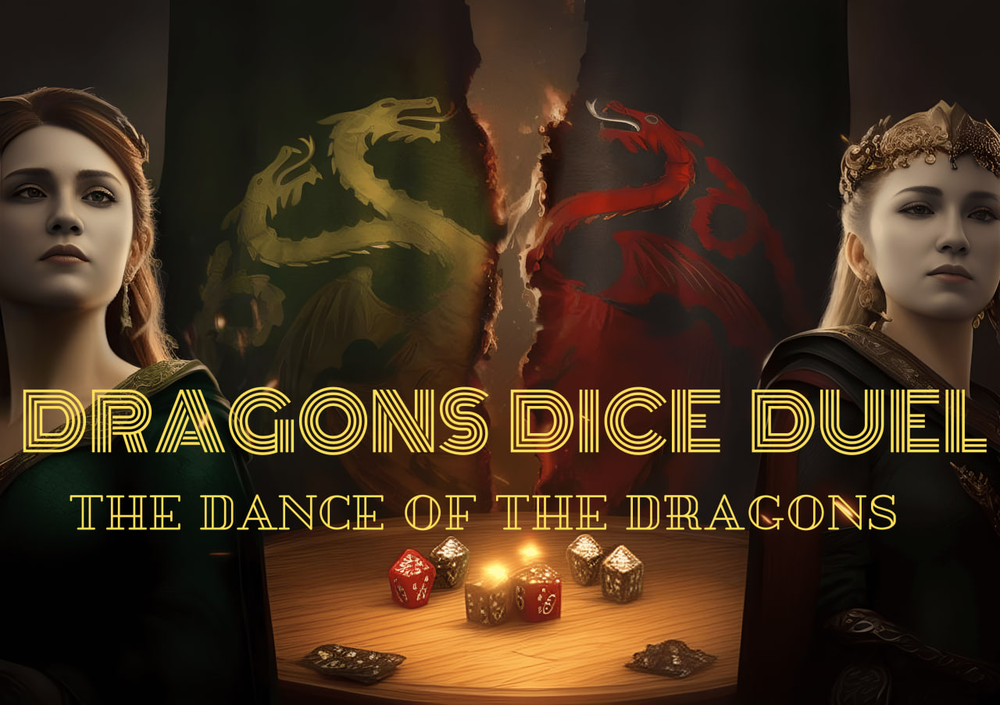

        <h1>Dragons' Dice Duel</h1>
        <h3>A Simple Turn-Based Game Using gRPC with Spring Boot</h3>

# Dragons' Dice Duel: The Dance of the Dragons

Dragons' Dice Duel is a simple turn-based game implementation inspired by the tumultuous conflict known as the Dance of the Dragons from the [House of the Dragon](https://www.hbo.com/house-of-the-dragon) series. This project utilizes gRPC (Google Remote Procedure Call) with Spring Boot to facilitate communication between game clients and the server.

## Scenario: The Dance of the Dragons

In the turbulent times of the Dance of the Dragons, House Targaryen is torn asunder by bitter familial feuds and political intrigue. The realm stands divided between two powerful factions:
- **[The Greens](https://awoiaf.westeros.org/index.php/Greens)**: Loyal to Aegon II Targaryen's claim to the throne.
- **[The Blacks](https://awoiaf.westeros.org/index.php/Blacks)**: Supporting Rhaenyra Targaryen's right to rule.

Players take on the roles of these factions in a dice-rolling game, where each roll represents a strategic maneuver or diplomatic victory aimed at gaining support from influential lords and allies across Westeros.

## Gameplay Mechanics

- **Turn-based Play**: Players take turns rolling a die using gRPC to communicate with the game server.
- **Point System**: Rolling a 6 earns the player 1 point and an extra turn, symbolizing successful alliances or strategic victories.
- **Winning Condition**: The first player to reach [131](https://awoiaf.westeros.org/index.php/131_AC) points wins the game, securing their faction's claim to the Iron Throne.

### Technologies Used

- **gRPC**: Facilitates efficient communication between the game server and clients.
- **Spring Boot**: Provides a robust framework for building the game server with Java.
- **Java**: Language used for server-side logic and game mechanics implementation.

## Under Development
Stay tuned, because winter is coming, and so is Dragons' Dice Duel: The Dance of the Dragons!

